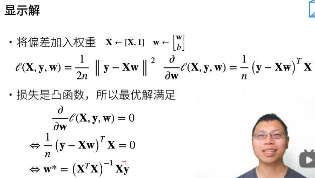

# 预备知识

### numpy array

```python
x = torch.tensor(1,2,3,4,5,6).reshape(-1,2)
```

2. 索引：

```python
x[1:3,:]# 区间都是左闭右开的
```

3. 执行原地操作：

```python
x+=y
x[:] = x+y# 都可以不开新的内存空间
```

选择超参需要并行

云计算、推荐算法、cv、nlp 搞算法toB

# 第9节课程

## softmax回归.

## 损失函数


# 额外学习资源：

markdown文档：

1. [Markdown 数学公式](http://blog.lisp4fun.com/2017/11/01/formula)
2. [Markdown中输入数学公式及LaTex常用数学符号整理](http://liyangbit.com/math/jupyter-latex/#32-%E5%B8%A6%E6%8B%AC%E5%8F%B7%E7%9A%84%E7%9F%A9%E9%98%B5-bmatrix-bmatrix)

范数符号：\parallel x \parallel  
双向箭头：\rightleftharpoons

```markdown
$\parallel x \parallel$
```

---

# 第三章 线性网络

## 接下来我将对线性回归进行深入的理解分析

### 所拥有的数据以及格式

假设我们拥有n个样本，记为

$$y = [y_1,y_2,...,y_n]^{T}\tag{1} $$

$$w = [w_1,w_2,...,w_m]^{T}\tag{2} $$

$$  X =[x_1,x_2,...,x_n]^T\tag{3}   $$

其中每一个元素$x_{i}$都是一个列向量

$$x_{i} = 
\left( \begin{matrix}
x_{1,1} \\
  ...  \\
  ...  \\
  x_{m,1}  \\
\end{matrix}
\right)
$$

$$X=
\left (
\begin {matrix}
  x_{1,1} & ... & x_{1,m} \\
  ... & ... & ... \\
  ... & ... & ... \\
  x_{n,1} & ... & x_{n,m} \\
\end{matrix}
\right )
$$

## 参数学习


**首先将第一个等式进行矩阵化，可以更好的看清其中的关系**
$$ \ell(X,y,w,b)  = \frac{1}{2n}\sum_{i = 1}^n(y_i-<x_i,w>-b)^2\tag{4}$$

这里有n个样本，每一个样本的loss如下
$$
\left (
\begin {matrix}
  (y_1-<x_1,w>-b)^2  \\
  (y_2-<x_2,w>-b)^2  \\
  ...  \\
  (y_n-<x_n,w>-b)^2 \\
\end{matrix}
\right )
$$

右边的等式为
$$
\frac{1}{2n}\parallel y-Xw-b\parallel ^2\tag{5}
$$
其中
$$dim(y) = n*1$$
$$dim(X) = n*m$$
$$dim(w) = m*1$$

其中
$$
Xw = 
\left [
\begin {matrix}
  x_1^T  \\
  x_2^T  \\
  ...  \\
  x_n^T \\
\end{matrix}
\right ]

*
\left [
\begin {matrix}
  w_1  \\
  w_2  \\
  ...  \\
  w_m \\
\end{matrix}
\right ]
=
\left [
\begin {matrix}
  x_1^Tw  \\
  x_2^Tw  \\
  ...  \\
  x_n^Tw \\
\end{matrix}
\right ]
=
\left [
\begin {matrix}
  <x_1^T,w>  \\
  <x_2^T,w>  \\
  ...  \\
  <x_n^T,w> \\
\end{matrix}
\right ]
$$

$$
dim(Xw) = n*1
$$

$\therefore$两边相等

## 将显示解求出来


将`X`变为
[**X**,**1**]
$$X=
\left (
\begin {matrix}
  x_{1,1} & ... & x_{1,m} & 1 \\
  ... & ... & ... & ...\\
  ... & ... & ... & ...\\
  x_{n,1} & ... & x_{n,m} & 1 \\

\end{matrix}
\right )
$$

将`w`变为
$$\left [
\begin {matrix}
  w  \\
  b  \\

\end{matrix}
\right ]
$$

下面开始求导，分析结果的合理性，以及如何才能求对
$$dim(y) = n*1$$
$$dim(X) = n*(m+1)$$
$$dim(w) = (m+1)*1$$

导数的结果维度一定为
$$ dim(\frac{\partial\ell(X,y,w,b)}{\partial w} ) = 数/(m+1,1) = (1,m+1)
$$
其中结果格式为
$$
\frac{1}{2n}(y-Xw-b)?T(-X?T)\tag{6}
$$

$$
dim(y-Xw-b) = (n,1)-(n,m+1)*(m+1,1)-(n,1) = (n,1)
$$ 

$$
dim(X) = n*(m+1)
$$


只有
$$
(n,1)^T*n*(m+1) = (1,m+1)
$$

$\therefore$正确的格式为

$$
\frac{1}{2n}(y-Xw-b)^T(-X)\tag{7}
$$

令上式为0就可以解得

$$
x^* = ({x^T}x)^{-1}x^Ty
$$
